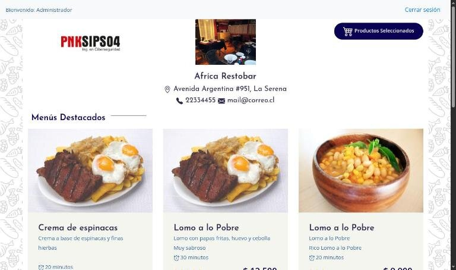
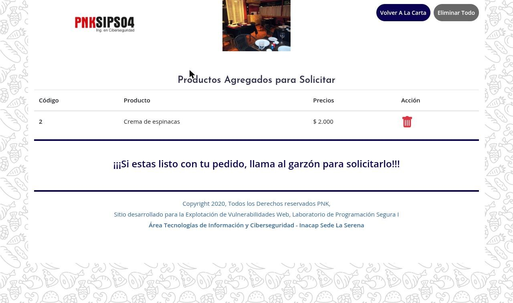
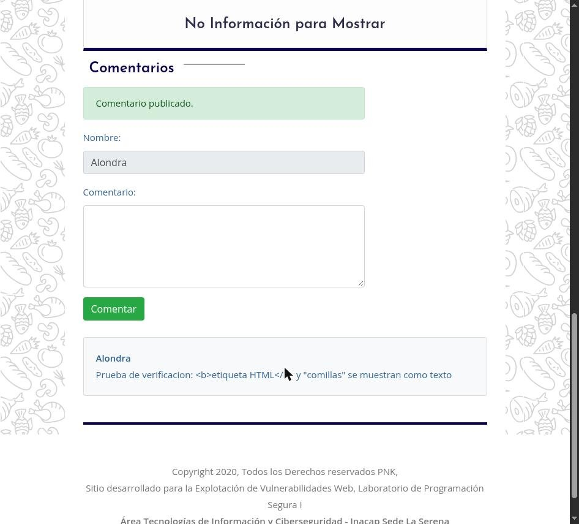
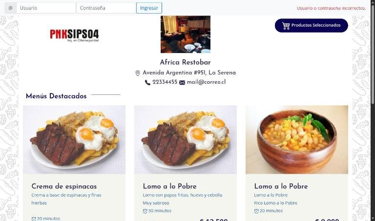

<div align="center">


# 🛡️ pnkSecurity

**Menú digital con carrito para restaurantes** — versión *corregida* de una aplicación PHP que se entregó con vulnerabilidades a propósito, trabajada en el Laboratorio de Programación Segura I (INACAP Sede La Serena).




</div>

---

## 📋 Índice

- [¿Qué hace?](#-qué-hace)
- [Las dos versiones del proyecto](#-las-dos-versiones-del-proyecto)
- [Seguridad: qué se corrigió](#-seguridad-qué-se-corrigió)
- [Stack técnico](#-stack-técnico)
- [Estructura del proyecto](#-estructura-del-proyecto)
- [Correrlo en local](#-correrlo-en-local)
- [Variables de entorno](#-variables-de-entorno)
- [Despliegue (AWS)](#-despliegue-aws)
- [Riesgo residual](#-riesgo-residual)
- [Integrantes](#-integrantes)

## ✨ ¿Qué hace?

| | |
|---|---|
| 🍽️ **Carta por restaurante** | Cada restaurante tiene su carta (`index.php?id=1`) con menús destacados, categorías, fotos, tiempos y precios en pesos chilenos. |
| 🛒 **Carrito** | Se agregan y quitan productos con AJAX. El precio siempre se toma de la base de datos, nunca del navegador. |
| 💬 **Comentarios** | Quien inició sesión puede dejar comentarios en la carta; el autor sale de su sesión, no de un campo editable. |
| 🔐 **Login** | Ingreso con correo y contraseña, mensajes genéricos y bloqueo temporal tras varios intentos fallidos. |

<details>
<summary><b>📸 Más capturas</b></summary>

<br>

| Carrito | Comentarios |
|---|---|
|  |  |

| Login con clave incorrecta |
|---|
|  |

</details>

## 🌿 Las dos versiones del proyecto

| Rama | Qué contiene |
|---|---|
| `main` | La aplicación **original, vulnerable a propósito** (para la fase de pentesting). No usar en producción. |
| `mejoras-por-vul` | La versión **corregida**, con **un commit por vulnerabilidad** (`VUL-01` a `VUL-12`) para ver cómo se solucionó cada una, más mejoras posteriores (HTTPS tras balanceador, hash señuelo en el login, limpieza) y la documentación. |

Cada corrección está documentada con evidencia antes/después en el *Informe técnico de remediación* del curso.

## 🔒 Seguridad: qué se corrigió

| N° | Vulnerabilidad | OWASP Top 10:2025 | Severidad | Corrección |
|---|---|---|---|---|
| VUL-01 | Inyección SQL en `?id=` y formularios | A05 Injection | 🔴 Crítica | Consultas preparadas (`consultar()` / `ejecutar()`) |
| VUL-02 | Inyección SQL en el login (bypass) | A05 / A07 | 🔴 Crítica | Consulta parametrizada y verificación de clave en PHP |
| VUL-03 | IDOR sobre el id de restaurante | A01 Broken Access Control | 🟠 Alta | Id validado en el servidor; autor tomado de la sesión |
| VUL-04 | XSS almacenado y reflejado | A05 Injection | 🟡 Media | Escape de salida con `e()` y rutas de imagen con lista blanca |
| VUL-05 | Sesión insegura | A07 Authentication Failures | 🟠 Alta | `HttpOnly`, `SameSite=Strict`, regenerar ID, caducidad |
| VUL-06 | Sin protección CSRF | A01 | 🟡 Media | Token por sesión validado con `hash_equals()` |
| VUL-07 | Validación insuficiente de entradas | A06 Insecure Design | 🟡 Media | `entero_get()` / `entero_post()`, límites y tipos |
| VUL-08 | Contraseñas en texto plano | A04 Cryptographic Failures | 🔴 Crítica | Comparación en tiempo constante (`verificar_password()`); ya acepta hashes. *Parcial: la base de datos no se modifica, ver riesgo residual* |
| VUL-09 | Credenciales de BD en el código | A02 Security Misconfiguration | 🟠 Alta | Variables de entorno `PNK_DB_*` *(parcial, ver riesgo residual)* |
| VUL-10 | Sin límite de intentos ni registro | A07 / A09 | 🟡 Media | Bloqueo por cuenta + IP y log de eventos de seguridad |
| VUL-11 | Errores y cabeceras expuestos | A02 / A10 | 🟢 Baja | CSP, `X-Frame-Options`, `nosniff`, errores genéricos, `.htaccess` |
| VUL-12 | jQuery 3.2.1 desactualizado | A03 Supply Chain | 🟡 Media | Actualizado a jQuery 3.7.1 |

Después de la remediación se agregaron tres mejoras, cada una en su propio commit: **HTTPS detrás de balanceador** (`PNK_TRUST_PROXY`), **hash señuelo en el login** (no toca la base de datos) y **limpieza del repositorio**.

## 🧱 Stack técnico

| Parte | Herramienta | Por qué |
| :--- | :--- | :--- |
| Backend | PHP 7.3+ (`mysqli`, `mbstring`) | Lenguaje de la aplicación original |
| Base de datos | MariaDB / MySQL | Esquema en `Script_BD/pnk_security.sql` |
| Frontend | Bootstrap 4 + jQuery 3.7.1 | Interfaz y llamadas AJAX del carrito |
| Servidor | Apache (`.htaccess`) o el servidor embebido de PHP | Apache aplica el endurecimiento del `.htaccess` |

## 📁 Estructura del proyecto

```
pnkSecurity/
├─ index.php               → carta del restaurante, login y comentarios
├─ mostrar_carrito.php      → vista del carrito
├─ carrito.php               → agregar / quitar / vaciar (AJAX, POST + CSRF)
├─ grcomentarios.php          → publicar comentarios
├─ setup/
│  ├─ setup.php               → núcleo de seguridad (BD, escape, sesión, CSRF, cabeceras, log)
│  ├─ procesalogin.php         → autenticación
│  └─ cerrar_sesion.php         → cierre de sesión
├─ js/controladorajax.js       → llamadas AJAX con token CSRF
├─ .htaccess                    → endurecimiento de Apache
└─ vendors/, css/, img/, imagenes/
Script_BD/
└─ pnk_security.sql             → esquema y datos de ejemplo (la base de datos no se modifica)
docs/screenshots/                → capturas de este README
```

## 💻 Correrlo en local

Requisitos: PHP 7.3+ con las extensiones `mysqli` y `mbstring`, y MariaDB o MySQL.

```sh
git clone https://github.com/matiasNon/pnkSecurity.git
cd pnkSecurity
git checkout mejoras-por-vul

# 1. Crear la base de datos
mysql -u root -e "CREATE DATABASE IF NOT EXISTS pnk_security"
mysql -u root pnk_security < Script_BD/pnk_security.sql

# 2. Levantar el servidor
php -S 127.0.0.1:8000 -t pnkSecurity
# abrir http://127.0.0.1:8000/index.php?id=1
```

> El servidor embebido de PHP **no lee `.htaccess`**: sirve para probar la aplicación, pero el bloqueo de `setup.php` y de los `.sql` solo se aplica con Apache.

## ⚙️ Variables de entorno

| Variable | Para qué | Por defecto |
|---|---|---|
| `PNK_DB_HOST` | Servidor de la base de datos | `localhost` |
| `PNK_DB_NAME` | Nombre de la base de datos | `pnk_security` |
| `PNK_DB_USER` | Usuario de la base de datos | `root` |
| `PNK_DB_PASS` | Contraseña de la base de datos | *(vacía)* |
| `PNK_DB_PORT` | Puerto de la base de datos | `3306` |
| `PNK_TRUST_PROXY` | `1` si hay un balanceador que termina HTTPS y envía `X-Forwarded-Proto` | *(desactivado)* |

## ☁️ Despliegue (AWS)

- Detrás de un balanceador (ALB / CloudFront) el HTTPS termina en el balanceador y PHP ve HTTP. Define `PNK_TRUST_PROXY=1` **solo** si el servidor no es accesible directamente: con la variable activa la cookie de sesión lleva `Secure` y se envía HSTS.
- Usa Apache con `AllowOverride All` para que el `.htaccess` surta efecto.
- Define las variables `PNK_DB_*` en el servidor, con un usuario de base de datos de mínimo privilegio.

## ⚠️ Riesgo residual

- **Contraseñas en texto plano:** la base de datos no se modifica, así que las claves de `usuarios` siguen guardadas sin hash. El código ya usa `password_verify()` si encuentra un hash, por lo que migrarlas a futuro no requiere cambios en la aplicación.
- **Usuario de BD:** por defecto la conexión usa `root` sin contraseña (para no romper el entorno de laboratorio). En producción hay que crear un usuario con privilegios mínimos y definir `PNK_DB_*`.
- **Contadores de intentos de login:** se guardan en un archivo temporal local; con varias instancias detrás de un balanceador cada una lleva su propia cuenta.
- **CSP:** los estilos aún permiten `'unsafe-inline'` y no se usa SRI en recursos de terceros.

## 👥 Integrantes

- Matías Nonque
- Savka Carvajal

<sub>Proyecto académico — Área Tecnologías de Información y Ciberseguridad, INACAP Sede La Serena. La rama `main` contiene vulnerabilidades intencionales.</sub>
