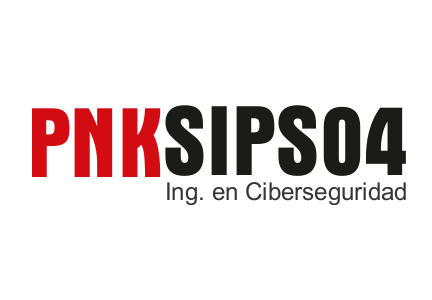
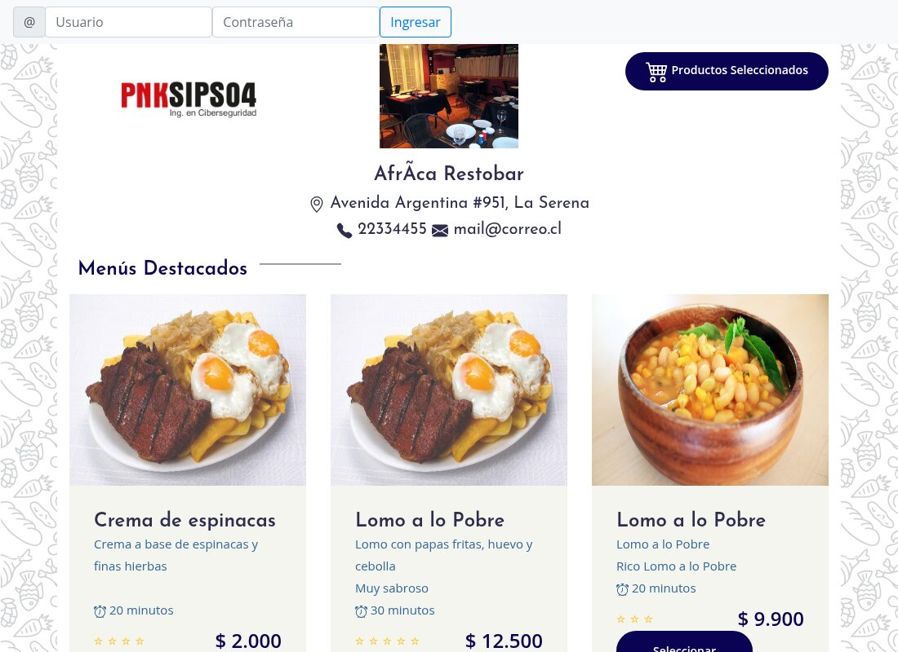

<div align="center">



# 🛡️ pnkSecurity

**Menú digital con carrito para restaurantes** — versión **original, vulnerable a propósito**, usada como objetivo de la revisión de seguridad del Laboratorio de Programación Segura I (INACAP Sede La Serena).




> ⚠️ **No usar en producción.** Esta rama contiene vulnerabilidades intencionales. La versión corregida está en la rama [`mejoras-por-vul`](https://github.com/matiasNon/pnkSecurity/tree/mejoras-por-vul).

</div>

---

## 📋 Índice

- [¿Qué hace?](#-qué-hace)
- [Las dos versiones del proyecto](#-las-dos-versiones-del-proyecto)
- [Para qué sirve esta rama](#-para-qué-sirve-esta-rama)
- [Stack técnico](#-stack-técnico)
- [Estructura del proyecto](#-estructura-del-proyecto)
- [Correrlo en local](#-correrlo-en-local)
- [Integrantes](#-integrantes)

## ✨ ¿Qué hace?

| | |
|---|---|
| 🍽️ **Carta por restaurante** | Cada restaurante tiene su carta (`index.php?id=1`) con menús destacados, categorías, fotos, tiempos y precios en pesos chilenos. |
| 🛒 **Carrito** | Se agregan y quitan productos con AJAX y se ve el resumen en `mostrar_carrito.php`. |
| 💬 **Comentarios** | Quien inició sesión puede dejar comentarios en la carta del restaurante. |
| 🔐 **Login** | Ingreso con correo y contraseña contra la tabla `usuarios`. |

## 🌿 Las dos versiones del proyecto

| Rama | Qué contiene |
|---|---|
| `main` | La aplicación **original, vulnerable a propósito** (esta rama), más el script de la base de datos original. |
| [`mejoras-por-vul`](https://github.com/matiasNon/pnkSecurity/tree/mejoras-por-vul) | La versión **corregida**, con **un commit por vulnerabilidad** (`VUL-01` a `VUL-12`), mejoras posteriores y la documentación. |

## 🎯 Para qué sirve esta rama

Esta versión es la **línea base** del trabajo del curso:

1. Se revisó el código (caja blanca) y se documentaron **12 hallazgos** (`VUL-01` a `VUL-12`) clasificados con OWASP Top 10:2025 y ASVS v5.
2. Cada hallazgo se corrigió en la rama `mejoras-por-vul`, con su evidencia *antes* y *después* en el informe técnico de remediación.

Los hallazgos cubren, entre otros temas: inyección SQL, control de acceso, XSS, gestión de sesión, CSRF, validación de entradas, almacenamiento de contraseñas, credenciales en el código, falta de límites y registro de eventos, divulgación de información y componentes desactualizados.

## 🧱 Stack técnico

| Parte | Herramienta | Por qué |
| :--- | :--- | :--- |
| Backend | PHP 7.4+ (`mysqli`) | Lenguaje de la aplicación original |
| Base de datos | MariaDB / MySQL | Esquema y datos en `Script_BD/pnk_security.sql` |
| Frontend | Bootstrap 4 + jQuery 3.2.1 | Interfaz y llamadas AJAX del carrito |

## 📁 Estructura del proyecto

```
pnkSecurity/
├─ index.php               → carta del restaurante, login y comentarios
├─ mostrar_carrito.php      → vista del carrito
├─ carrito.php               → agregar / quitar / vaciar (AJAX)
├─ grcomentarios.php          → publicar comentarios
├─ setup/
│  ├─ setup.php               → conexión a la BD y funciones auxiliares
│  ├─ procesalogin.php         → autenticación
│  └─ cerrar_sesion.php         → cierre de sesión
├─ js/controladorajax.js       → llamadas AJAX del carrito
└─ vendors/, css/, img/, imagenes/
Script_BD/
└─ pnk_security.sql             → esquema y datos de la base de datos original
docs/screenshots/                → captura de este README
```

## 💻 Correrlo en local

Requisitos: PHP 7.4+ con la extensión `mysqli` y MariaDB o MySQL. Solo en una máquina de pruebas, nunca expuesta a Internet.

```sh
git clone https://github.com/matiasNon/pnkSecurity.git
cd pnkSecurity

# 1. Crear la base de datos
mysql -u root -e "CREATE DATABASE IF NOT EXISTS pnk_security"
mysql -u root pnk_security < Script_BD/pnk_security.sql

# 2. Levantar el servidor
php -S 127.0.0.1:8000 -t pnkSecurity
# abrir http://127.0.0.1:8000/index.php?id=1
```

> La aplicación se conecta como `root` sin contraseña a la base `pnk_security` en `localhost`. Con PHP 8.2 o superior pueden aparecer avisos por funciones obsoletas (`utf8_encode`).

## 👥 Integrantes

- Matías Nonque
- Savka Carvajal

<sub>Proyecto académico — Área Tecnologías de Información y Ciberseguridad, INACAP Sede La Serena.</sub>
